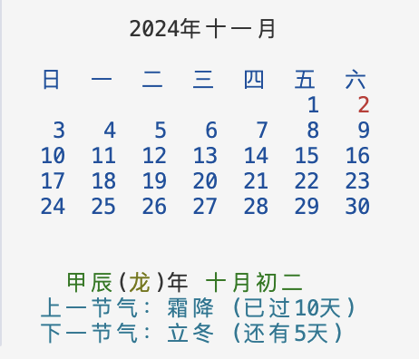

# 多功能税收/贷款计算器与日历工具

这是一个基于 Python 的多功能工具，包含中国传统历法显示、中美税收计算功能。

## 功能特点

### 农历日历部分
- 📅 显示当月公历日历
- 🌙 显示当日农历日期
- 🐲 显示生肖年份
- 🌺 显示干支纪年
- 🌞 显示节气信息（上一个/下一个节气及间隔天数）
- 🎨 彩色终端显示支持

### 税收计算部分 (2024年版)
#### 美国税收
- 💰 联邦税计算
- 🏛️ 加州州税计算
- 👥 支持单身和夫妻共同申报
- 📊 自动计算各类税费
- 📈 显示边际税率分析

#### 中国税收
- 💰 个人所得税计算
- 🏢 五险一金计算（个人与企业部分）
- 📋 专项附加扣除：
  - 住房租金（分城市层级）
  - 住房贷款利息
  - 子女教育
  - 继续教育
  - 赡养老人
  - 大病医疗
- 📊 完整税负分析
- 📈 边际税率计算

### 贷款计算部分
- 💰 公积金贷款额度计算
- 💰 商业贷款额度计算
- 💰 贷款利息计算

## 依赖项
```bash
pip install zhdate colorama ephem tabulate
```

## 主要组件

### 农历日历模块
1. **日历显示** (`show_calendar`)
2. **农历转换** (`ZhDate`)
3. **节气计算** (`get_solar_term_date`)

### 税收计算模块
1. **美国税率表** (`USTaxConstants`)
   - 2024年联邦税率表
   - 2024年加州税率表
   - 各类扣除额限额

2. **中国税率表** (`CNTaxConstants`)
   - 个人所得税七级税率表
   - 五险一金费率（以北京为例）
   - 专项附加扣除标准
   - 城市分级标准

3. **税收计算**
   - 美国税收计算 (`calculate_us_tax`)
   - 中国税收计算 (`calculate_cn_tax`)
   - 边际税率分析

### 贷款计算模块
- 公积金贷款额度计算 (`calculate_fund_loan`)
- 商业贷款额度计算 (`calculate_commercial_loan`)
- 贷款利息计算 (`calculate_loan_interest`)

## 使用方法

### 查看日历
```bash
python my_calendar.py
```

### 计算美国税收
```bash
python us_tax.py
```

### 计算中国税收
```bash
python cn_tax.py
```

### 计算贷款
```bash
python cn_mortgage.py
```

## 示例输出

### 日历显示


### 税收计算
```
========== 2024年税收分析 ==========
总工资收入：$350,000.00
401(k)供款：$23,000.00
调整后收入：$327,000.00
资本利得：$20,000.00

税前扣除
+------------------+--------------------+--------------------+
| 项目             | 单身申报           | 夫妻共同申报       |
+==================+====================+====================+
| 401(k)供款       | $23,000.00        | $23,000.00        |
| 联邦标准扣除额     | $14,600.00        | $29,200.00        |
| 加州标准扣除额     | $5,363.00         | $10,726.00        |
+------------------+--------------------+--------------------+
...
```

### 中国税收计算
```
========== 2024年个人所得税分析 ==========
月度工资：¥50,000.00
所在城市：北京

个人缴纳五险一金
+------------------+------------------+
| 项目             | 金额             |
+==================+==================+
| 养老保险         | ¥2,550.72       |
| 医疗保险         | ¥637.68         |
| 失业保险         | ¥159.42         |
| 住房公积金       | ¥3,826.08       |
| 合计             | ¥7,173.90       |
+------------------+------------------+

企业缴纳五险一金
+------------------+------------------+
| 项目             | 金额             |
+==================+==================+
| 养老保险         | ¥5,101.44       |
| 医疗保险         | ¥3,029.98       |
| 失业保险         | ¥159.42         |
| 工伤保险         | ¥127.54         |
| 生育保险         | ¥255.07         |
| 住房公积金       | ¥3,826.08       |
| 合计             | ¥12,499.53      |
+------------------+------------------+

个税计算
+------------------+------------------+
| 项目             | 金额             |
+==================+==================+
| 应纳税所得额     | ¥35,826.10      |
| 专项附加扣除     | ¥2,000.00       |
| 个人所得税       | ¥2,873.91       |
+------------------+------------------+

边际税率分析
+------------------+------------------+
| 项目             | 税率             |
+==================+==================+
| 个税边际税率     | 25.0%           |
| 社保边际费率     | 10.5%           |
| 公积金边际费率   | 12.0%           |
| 总边际税率       | 47.5%           |
+------------------+------------------+

总体税负分析
+------------------+------------------+
| 项目             | 比率             |
+==================+==================+
| 个人所得税率     | 5.7%            |
| 个人五险一金率   | 14.3%           |
| 企业五险一金率   | 25.0%           |
| 总体税负率       | 45.0%           |
+------------------+------------------+

最终收入
+------------------+------------------+
| 项目             | 金额             |
+==================+==================+
| 税前月收入       | ¥50,000.00      |
| 税后月收入       | ¥39,952.19      |
| 年度税后收入     | ¥479,426.28     |
| 企业总成本       | ¥62,499.53      |
+------------------+------------------+
```

### 贷款计算
```
==================== 房贷计算结果 ====================

贷款信息
+----------------+---------------+
| 项目           | 金额          |
+================+===============+
| 总贷款金额     | ¥7,000,000.00 |
+----------------+---------------+
| 商业贷款金额   | ¥6,925,000.00 |
+----------------+---------------+
| 公积金贷款金额 | ¥75,000.00    |
+----------------+---------------+
| 贷款年限       | 30年          |
+----------------+---------------+
| 商业贷款利率   | 3.00%         |
+----------------+---------------+
| 公积金贷款利率 | 2.00%         |
+----------------+---------------+

等额本息还款
+------------------+----------------+
| 项目             | 金额           |
+==================+================+
| 月供             | ¥29,473.29     |
+------------------+----------------+
| 商业贷款月供     | ¥29,196.08     |
+------------------+----------------+
| 公积金贷款月供   | ¥277.21        |
+------------------+----------------+
| 总还款额         | ¥10,610,385.82 |
+------------------+----------------+
| 总利息           | ¥3,610,385.82  |
+------------------+----------------+
| 商业贷款总利息   | ¥3,585,588.56  |
+------------------+----------------+
| 公积金贷款总利息 | ¥24,797.26     |
+------------------+----------------+

等额本金还款
+------------------+----------------+
| 项目             | 金额           |
+==================+================+
| 首月月供         | ¥36,881.94     |
+------------------+----------------+
| 末月月供         | ¥19,492.88     |
+------------------+----------------+
| 月供递减金额     | ¥48.44         |
+------------------+----------------+
| 总还款额         | ¥10,147,468.75 |
+------------------+----------------+
| 总利息           | ¥3,147,468.75  |
+------------------+----------------+
| 商业贷款总利息   | ¥3,124,906.25  |
+------------------+----------------+
| 公积金贷款总利息 | ¥22,562.50     |
+------------------+----------------+
```

## 重要说明

### 中国税收相关
- 个人所得税起征点：¥5,000/月
- 专项附加扣除标准：
  - 住房租金：一线城市¥2,000/月，二线城市¥1,500/月，其他城市¥1,100/月
  - 住房贷款利息：固定¥1,000/月
  - 子女教育：每个子女¥1,000/月
  - 继续教育：学历教育¥400/月，技能教育¥3,600/年
  - 赡养老人：独生子女最高¥2,000/月
- 五险一金比例因地区而异，程序使用北京标准

### 美国税收相关
- 税率和限额基于2024年数据
- 401(k)默认最大化供款($23,000)
- 所有金额均为美元
- 建议定期检查税率更新

### 贷款相关
- 公积金贷款额度上限：120万
- 首付比例要求：最低30%
- 贷款年限：最长30年

## 贡献

欢迎提交 Issue 和 Pull Request！

## 许可证

MIT License